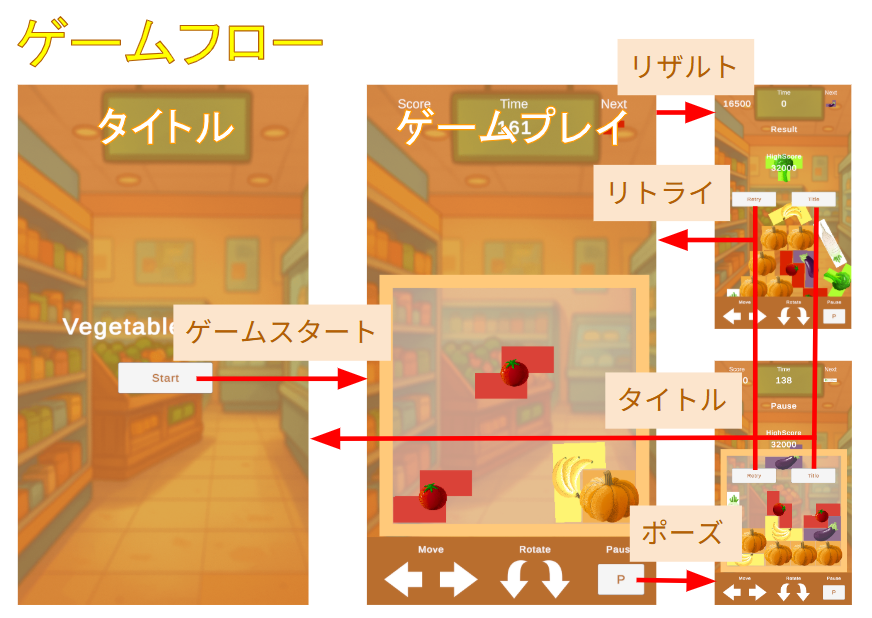

# VegetablesGame


自動で落下してくる、野菜を模したパズルブロックを積み重ねていくゲーム。  
基本的な操作は左右移動と左右回転のみ！ブロックを隙間なく詰め込めるとポイントゲットです。  
さらに上へと積み上げることでもポイントが入ります。ただし場外に落としてしまうとその時点でゲーム終了なので気をつけましょう！

## 使用したツールなど
* Unity (ver.2022.3.62f1)
* Visual Studio
* 利用したアセット
1. Food Icons Pack
2. Cartoon FX Remaster Free
3. Unity Recorder
* 画像編集ツール

(Unity Recorderと画像編集ツール)
Unity上で背景透過のオブジェクト画像ファイルを作成し、別途編集ツールでサイズ等の調整を行いました。

## 制作に当たって
Unityの2Dゲームの基本的な技術内容を抑えつつ、ありそうでなかった珍しい体験ができるゲームを考案しました。
* マウス・キーボード操作とスマートフォンのタップ操作の両対応
* 2Dパズルだが物理挙動に則って動く楽しさと難しさ
* 達成感を得られるようにポイントゲットの際はエフェクトを活用
* 何度も挑戦したくなるようにハイスコアを記録
* いつでもゲームをやり直したりハイスコアを確認したりできるUI

## ゲーム企画
  
  
  

## 作品のポイント
### 隙間なく詰める＋高く積み重ねる 2つのゲーム性 
  
ゲーム開始時はボックスにどれだけパズルブロックを綺麗に詰めて隙間を作らないようにするかといった、落ちものパズルのようなゲーム性ですが、後半は隙間なく積むことよりもどれだけ高く積めるかといったゲーム性に変わります。ただし次のパズルブロックが投下されるのは現在のブロックの動きが止まったときなので、後半戦でもブロックが揺れないように安定した綺麗な足場を作る必要があります。

VegetablesGenerator.csの抜粋
```C#
public GameObject[] vegetables; // パズルブロック（プレハブ）の配列
GameObject vegetable;

vegetable = Instantiate(vegetables[rand], transform.position, vegetables[rand].transform.rotation); // パズルブロックをランダム生成
vegetable.transform.SetParent(transform);

// ボックスの中にあるコライダーに当たり、動きが止まったときに処理を実行
if (!waitFlag && vegetable.GetComponent<Vegetable>().CollisionCheck() && vegetable.GetComponent<Rigidbody2D>().velocity == Vector2.zero)
{
    vegetable.transform.SetParent(droppedVegetables);
    vegetable.tag = "droppedVegetable";

    foreach (ColliderCheck colliderCheck in colliderCheckList)
    {
        if (colliderCheck.FlagCheck() && !colliderCheck.EffectCheck())
        {
            colliderCheck.EffectPlay();
            touchCount++;
            GameController.stagePoints += touchCount * touchPoint;
        }
    }

    // ボックスの外に出て一定以上の高さになったら、画面スクロール処理をコルーチンで実行
    if (!scrollFlag && cameraScroll.FlagCheck())
    {
        scrollFlag = true;
        waitFlag = true;
        StartCoroutine(Coroutine());
    }
    else
    {
        objDrop();
    }
}
```

### 物理挙動の楽しさと難しさを味わえる2Dパズル
  
2Dパズルですが決められたマス目に落ちていくわけではないため、ブロックが斜めに落ちてしまったり、他のブロックに引っかかって落ちなかったりする場合もあります。そんなときも移動や回転で上手く隙間に入れたり、他のブロックを間接的に動かしたりして、物理挙動ならではの攻略法を見つけられます。コード上ではそういった物理挙動のブロックを正確に把握できるよう、あえてサークルコライダーを使って接触範囲を限定する等の工夫をしています。

ColliderCheck.csの抜粋
```C#
// ハッシュリストを使い、同じコライダーを除くようにする
HashSet<Collider2D> touchingObjects = new HashSet<Collider2D>();
bool countFlag;

void Update()
{
    // 1列にブロックが9個並んだとき、隙間がなくなる想定
    if (touchingObjects.Count >= 9)
    {
        countFlag = true;
    }
    else
    {
        countFlag = false;
    }
}

void OnTriggerEnter2D(Collider2D other)
{
    if (other is CircleCollider2D) // ブロックのサークルコライダーが触れたときのみ反応
    {
        touchingObjects.Add(other);
    }
}

void OnTriggerExit2D(Collider2D other)
{
    if (other is CircleCollider2D) // ブロックのサークルコライダーが離れたときのみ反応
    {
        touchingObjects.Remove(other);
    }
}
```

### シンプルでストレスフリーなUI
  
絶え間なくブロックが落ちてくる忙しいゲームでもあるため、ポーズ機能を実装の上、「上手く並べられずハイスコアが無理なのに制限時間いっぱいまでゲームをする」といった事態を避けるため、いつでもリトライ、ハイスコアの確認ができるようにしました。またスマートフォンのタッチ操作でもプレイしやすいようにボタンは画面下に配置し、どのボタンがどの機能か一目で分かるように工夫しました。

## 今後の制作
* ブロックごとの特色を出す（カボチャは重い、トマトは滑りやすい等）
* 同じブロックが近くに並んだとき、別途ポイントを加算する
* 特定のボタンを押すことで落下スピードを速める
* 次に出現するブロックの再抽選機能を作る
